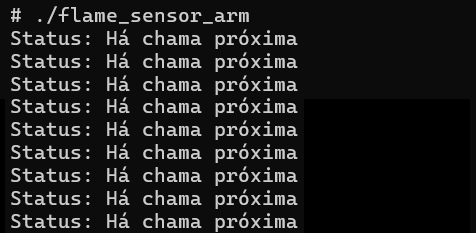
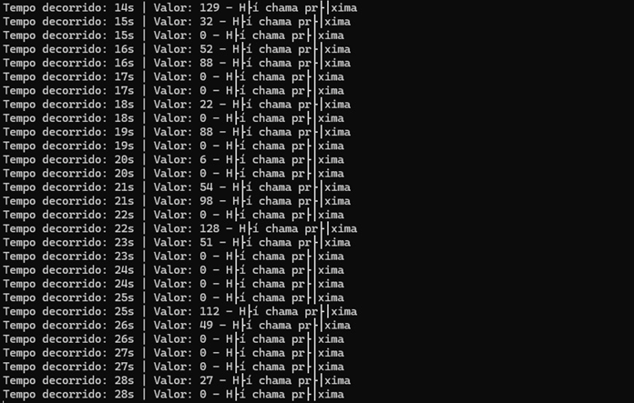
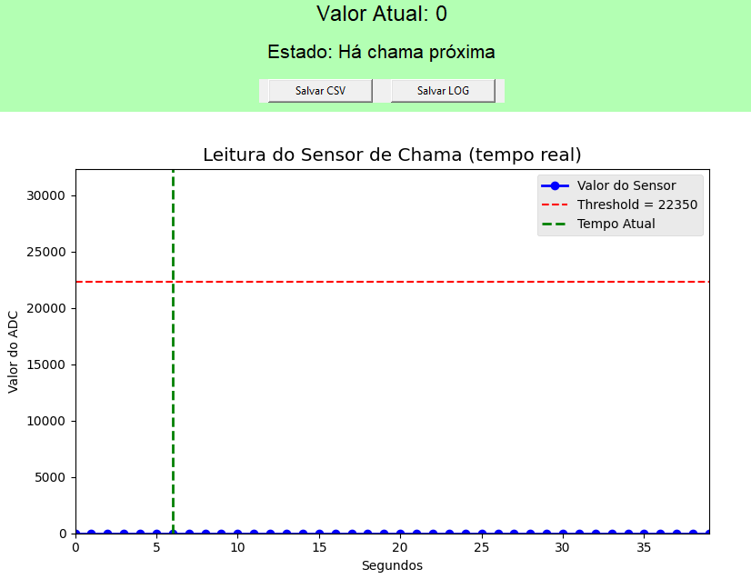

# Sistema de Detecção de Chama com STM32MP1
### Visão Geral

  Este repositório apresenta a implementação de um módulo de detecção de chama utilizando o sensor Flame1100Nm em conjunto com a placa STM32MP1-DK1.
A proposta é identificar a presença de fogo ou fontes de calor próximas à carga monitorada. Caso seja detectado um valor abaixo de um limite definido (threshold), o sistema considera que há chama próxima; se o valor estiver acima, assume-se que não há chama no ambiente.

  Esse módulo foi desenvolvido em C++, seguindo princípios de orientação a objetos. O uso de uma classe dedicada ao sensor garante melhor organização do código e simplifica a integração com outros dispositivos do projeto de monitoramento centralizado.

### **Requisitos**
1) **Compilação**

Ambiente de compilação cruzada (cross-toolchain) para ARM, como:
`arm-linux-gnueabihf-g++`

2) **Documentação**

  * **Doxygen** para gerar documentação técnica.

  * **Graphviz** para construção de diagramas automáticos.

### **Organização do Código**

O núcleo do projeto é a classe **`FlameSensor`** que abstrai o funcionamento do sensor e oferece métodos de fácil utilização.

### **Estrutura da Classe**

Atributo
  path: endereço no sistema Linux embarcado que representa o canal ADC do sensor.

Funções principais:
  
  `bool lerSensor()`: acessa o valor do ADC pelo canal in_voltage19_raw e o compara com metade do nível lógico.
  
  Retorna `0` → Detectou chama.
  
  Retorna `1` → Não detectou chama.

`string Status()`: Fornece uma mensagem em texto indicando o resultado da leitura:\
  Se recebe `0` retorna `Há chama próxima`\
  Se recebe `1` retorna `Não há chama próxima`

`int main()`: O código principal instancia a classe `FlameSensor` e executa um loop contínuo de leitura.

A cada um segundo, o estado é exibido no terminal.
O laço pode ser encerrado pelo usuário ao digital Ctrl+C.

## **Como Compilar e Executar**
### **1. Clonar o projeto**
```
git clone (https://github.com/Rui-rock/Trabalho_ProgAp/tree/main)
cd Trabalho_ProgAp
```
### **2. Compilar**

Baixar a toolchain:

Baixe o arquivo **`arm-buildroot-linux-gnueabihf_sdk-buildroot.tar.gz`** nesse [link](https://drive.google.com/file/d/1qpq3QeK5f7T061LFA0JlJz2fgMQDvyMn/view)
. Esta toolchain permitirá a compilação cruzada para o kit de desenvolvimento DK1.

Extraia a toolchain ARM:
```
tar -xvf arm-buildroot-linux-gnueabihf_sdk-buildroot.tar.gz
```
Compile o programa:
```
arm-linux-gnueabihf-g++ -o flame_sensor_arm flame_sensor.cpp -std=c++17
```
### **3. Executar na STM32MP1**

Envie o binário para a placa via scp:
```
scp -O  flame_sensor_arm root@<ip_da_placa>:/root
```
No terminal da placa:
```
chmod +x flame_sensor_arm
./flame_sensor_arm
```
O programa exibirá o status continuamente.
**
```
Exemplo de Saída**
  Status: Não há chama próxima
  Status: Não há chama próxima
  Status: Há chama próxima
```

### Execução

Exemplo de execução. No caso, a foto abaixo é uma versão anterior. A mensagem de status também informa o valor de tensão e o IP da máquina de envio da mensagem.



### **Documentação Automática**
  A documentação pode ser gerada em diferentes formatos com o **Doxygen** .
  Crie ou edite o arquivo `Doxyfile`.

Ative as opções:
```
INPUT = Cliente_leitor.cpp
GENERATE_HTML   = YES
GENERATE_LATEX  = YES
RECURSIVE = YES
HAVE_DOT        = YES
DOT_IMAGE_FORMAT       = svg
DOT_PATH = /opt/homebrew/bin  # (ou use `which dot` no terminal para achar o caminho)
CALL_GRAPH = YES
CALLER_GRAPH = YES
DOT_CLEANUP            = YES
CLASS_DIAGRAMS = YES
UML_LOOK = YES
DOT_UML_DETAILS = YES
```
Execute no terminal do diretório que contém o arquivo Leitor.cpp:
```
  doxygen Doxyfile
```
  • `html/`: documentação em páginas web.

  • `latex/`: arquivos .tex que podem ser convertidos em PDF.

  • `rtf/`: documentação em Rich Text, compatível com editores de texto.
  
## Comunicação UDP
  Após obter a leitura do sensor de chama, o sistema embarcado envia as informações para um servidor remoto via protocolo UDP (User Datagram Protocol).
  
| Parâmetro                | Valor       | 
|--------------------------|-------------|
| IP do servidor           | 192.168.42.10 | 
| IP da placa STM32MP1-DK1 | 192.168.42.2  | 
| Porta UDP                | 5000  | 
| Intervalo de envio       | 1 segundo | 
| Formato da mensagem      | Valor XXXX - "Há chama próxima" ou "Não há chama próxima" | 

### Funcionamento do Cliente UDP
1) O programa cria um socket UDP (SOCK_DGRAM) para envio dos pacotes.

2) A cada segundo, a classe `FlameSensor` lê o valor do ADC e decide se há ou não chama.

3) A mensagem correspondente é enviada ao IP do servidor via função:
```
sendto(sock, status.c_str(), status.size(), 0, (sockaddr*)&servAddr, sizeof(servAddr));
```
4) O servidor escuta na porta 5000 e exibe cada mensagem recebida.
**Protocolo de mensagem**
A comunicação não tem confirmação de recebimento (característica do UDP). Cada pacote contém apenas uma string ASCII. O UDP apresenta como vantagens nesse caso a baixa latência, o overhead mínimo e a maior simplicidade de implementação em relação a protocolos como TCP.



Pode-se visualizar a chegada dos pacotes pelo software *Wireshark*, na qual as linhas que seguem o protocolo UDP e são endereçadas à porta 5000 vêm de transmissão do estado do sensor.
   

**Imagem do Wireshark**

O servidor também realiza a escrita de mensagens chegadas do sensor de 40s passados até o momento da leitura em um arquivo `log.txt`. O tempo indicado como *tempo decorrido* indica o tempo cronometrado pelo servidor, e reinicia para zero ao chegar em 40s. A mensagem aparece estranha no terminal pois a conversão de caracteres ASCII não é feita da mesma forma, mas a mensagem chega correta. 

## Interface

O programa da interface converte o arquivo `log.txt` em figura. Ele atualiza a cada 1s e mostra um intervalo de 40s. 

Os pontos azuis são referentes ao valor que o sensor indica. Nesse caso, abaixo da linha vermelha, indica que há chama. Acima, indica que não há. Já a linha verde indica o tempo atual cronometrado pelo servidor e se move a cada 1s. 

No topo da janela, mostra-se o valor atual lido pelo sensor e opções de salvar os valores em CSV ou LOG. O fundo verde limão acima se torna vermelho quando os valores lidos ultrapassam a janela da interface.



